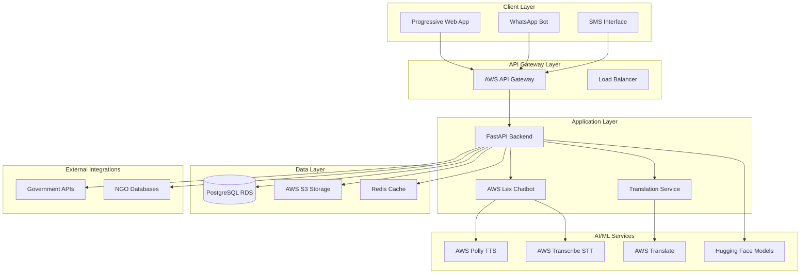
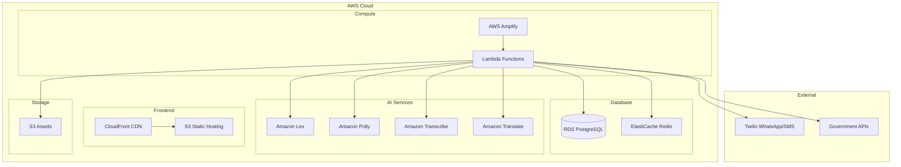

# Design Document: JanAI - AI-Powered Civic Assistant

## Overview

JanAI is a comprehensive AI-powered civic assistant designed to bridge the digital divide for underserved communities. The system provides multilingual, voice-first access to verified government services, healthcare information, and civic resources through multiple channels optimized for low-bandwidth environments.

The architecture follows a microservices approach with AWS cloud services, ensuring scalability, reliability, and cost-effectiveness suitable for a hackathon project that can scale to production use.

## Architecture

### High-Level Architecture



### Deployment Architecture



## Components and Interfaces

### 1. Progressive Web Application (PWA)

**Technology Stack:**
- Frontend Framework: Vue.js 3 with Composition API
- UI Library: Vuetify 3 for Material Design components
- PWA Features: Workbox for service worker management
- State Management: Pinia for reactive state
- Build Tool: Vite for fast development and optimized builds

**Key Features:**
- Offline-first architecture with intelligent caching
- Responsive design optimized for mobile devices
- Voice input/output integration
- Multilingual UI with RTL support
- Accessibility compliance (WCAG 2.1 AA)
- Push notification support

**Interface Specifications:**
```typescript
interface PWAConfig {
  serviceWorker: {
    cacheStrategy: 'CacheFirst' | 'NetworkFirst' | 'StaleWhileRevalidate';
    maxCacheSize: number;
    offlinePages: string[];
  };
  manifest: {
    name: string;
    shortName: string;
    icons: IconDefinition[];
    startUrl: string;
    display: 'standalone' | 'fullscreen';
  };
}

interface VoiceInterface {
  startRecording(): Promise<void>;
  stopRecording(): Promise<AudioBlob>;
  playAudio(audioUrl: string): Promise<void>;
  getSupportedLanguages(): string[];
}
```

### 2. Backend API Service

**Technology Stack:**
- Framework: FastAPI with Python 3.9+
- Authentication: JWT tokens with AWS Cognito
- API Documentation: OpenAPI/Swagger auto-generation
- Validation: Pydantic models for request/response validation
- Async Support: AsyncIO for concurrent operations

**Core Modules:**
- User Management and Authentication
- Conversation Management
- Resource Information Service
- Translation and Localization
- Analytics and Logging
- External API Integration

**Interface Specifications:**
```python
from pydantic import BaseModel
from typing import List, Optional, Dict, Any

class ConversationRequest(BaseModel):
    user_id: str
    message: str
    language: str
    channel: str  # 'web', 'whatsapp', 'sms'
    voice_data: Optional[str] = None

class ConversationResponse(BaseModel):
    response_text: str
    response_audio_url: Optional[str]
    suggested_actions: List[str]
    resources: List[Dict[str, Any]]
    conversation_id: str

class ResourceInfo(BaseModel):
    id: str
    title: str
    description: str
    category: str
    eligibility_criteria: List[str]
    application_process: str
    contact_info: Dict[str, str]
    last_updated: str
```

### 3. AI/ML Integration Layer

**AWS Lex Configuration:**
- Intent Recognition: Custom intents for civic queries
- Slot Types: Government schemes, locations, demographics
- Fulfillment: Lambda functions for complex logic
- Multi-language Support: English, Spanish, Hindi, Bengali, Tamil

**Hugging Face Integration:**
- Models: Multilingual BERT for intent classification
- Custom Fine-tuning: Domain-specific civic terminology
- Fallback Processing: When AWS Lex confidence is low

**Voice Processing Pipeline:**
```python
class VoiceProcessor:
    def __init__(self):
        self.transcribe_client = boto3.client('transcribe')
        self.polly_client = boto3.client('polly')
        self.translate_client = boto3.client('translate')
    
    async def process_voice_input(self, audio_data: bytes, 
                                 source_language: str) -> str:
        # Transcribe audio to text
        transcript = await self.transcribe_audio(audio_data, source_language)
        return transcript
    
    async def generate_voice_response(self, text: str, 
                                    target_language: str) -> str:
        # Convert text to speech
        audio_url = await self.synthesize_speech(text, target_language)
        return audio_url
```

### 4. Multi-Channel Communication

**WhatsApp Business API Integration:**
- Provider: Twilio or Meta Business Platform
- Message Types: Text, audio, interactive buttons
- Webhook Handling: Real-time message processing
- Fallback Mechanism: Automatic SMS fallback

**SMS Integration:**
- Provider: Twilio SMS API
- Message Optimization: Concise responses under 160 characters
- Command Processing: Simple keyword-based commands
- Link Shortening: For web interface access

**Channel Interface:**
```python
class ChannelManager:
    def __init__(self):
        self.whatsapp_client = TwilioWhatsAppClient()
        self.sms_client = TwilioSMSClient()
    
    async def send_message(self, channel: str, recipient: str, 
                          message: str, media_url: Optional[str] = None):
        if channel == 'whatsapp':
            return await self.whatsapp_client.send_message(
                recipient, message, media_url
            )
        elif channel == 'sms':
            return await self.sms_client.send_sms(recipient, message)
```

### 5. Data Management System

**Database Schema:**
```sql
-- Users table
CREATE TABLE users (
    id UUID PRIMARY KEY DEFAULT gen_random_uuid(),
    phone_number VARCHAR(20) UNIQUE,
    preferred_language VARCHAR(10) DEFAULT 'en',
    accessibility_settings JSONB,
    created_at TIMESTAMP DEFAULT NOW(),
    last_active TIMESTAMP DEFAULT NOW()
);

-- Conversations table
CREATE TABLE conversations (
    id UUID PRIMARY KEY DEFAULT gen_random_uuid(),
    user_id UUID REFERENCES users(id),
    channel VARCHAR(20) NOT NULL,
    started_at TIMESTAMP DEFAULT NOW(),
    ended_at TIMESTAMP,
    language VARCHAR(10) NOT NULL
);

-- Messages table
CREATE TABLE messages (
    id UUID PRIMARY KEY DEFAULT gen_random_uuid(),
    conversation_id UUID REFERENCES conversations(id),
    sender_type VARCHAR(10) NOT NULL, -- 'user' or 'system'
    content TEXT NOT NULL,
    message_type VARCHAR(20) DEFAULT 'text', -- 'text', 'audio', 'image'
    created_at TIMESTAMP DEFAULT NOW()
);

-- Resources table
CREATE TABLE resources (
    id UUID PRIMARY KEY DEFAULT gen_random_uuid(),
    title VARCHAR(255) NOT NULL,
    description TEXT,
    category VARCHAR(50) NOT NULL,
    eligibility_criteria JSONB,
    application_process TEXT,
    contact_info JSONB,
    source_url VARCHAR(500),
    last_updated TIMESTAMP DEFAULT NOW(),
    is_active BOOLEAN DEFAULT TRUE
);

-- User interactions table for analytics
CREATE TABLE user_interactions (
    id UUID PRIMARY KEY DEFAULT gen_random_uuid(),
    user_id UUID REFERENCES users(id),
    action_type VARCHAR(50) NOT NULL,
    resource_id UUID REFERENCES resources(id),
    metadata JSONB,
    created_at TIMESTAMP DEFAULT NOW()
);
```

**Caching Strategy:**
- Redis for session management and frequently accessed resources
- Application-level caching for translation results
- CDN caching for static assets and audio files

## Data Models

### Core Domain Models

```python
from enum import Enum
from datetime import datetime
from typing import List, Optional, Dict, Any

class ChannelType(Enum):
    WEB = "web"
    WHATSAPP = "whatsapp"
    SMS = "sms"

class MessageType(Enum):
    TEXT = "text"
    AUDIO = "audio"
    IMAGE = "image"

class User:
    def __init__(self, id: str, phone_number: str, 
                 preferred_language: str = "en"):
        self.id = id
        self.phone_number = phone_number
        self.preferred_language = preferred_language
        self.accessibility_settings = {}
        self.created_at = datetime.now()
        self.last_active = datetime.now()

class Conversation:
    def __init__(self, user_id: str, channel: ChannelType, 
                 language: str):
        self.id = generate_uuid()
        self.user_id = user_id
        self.channel = channel
        self.language = language
        self.messages: List[Message] = []
        self.started_at = datetime.now()
        self.context = {}

class Message:
    def __init__(self, conversation_id: str, sender_type: str, 
                 content: str, message_type: MessageType = MessageType.TEXT):
        self.id = generate_uuid()
        self.conversation_id = conversation_id
        self.sender_type = sender_type  # 'user' or 'system'
        self.content = content
        self.message_type = message_type
        self.created_at = datetime.now()

class Resource:
    def __init__(self, title: str, description: str, category: str):
        self.id = generate_uuid()
        self.title = title
        self.description = description
        self.category = category
        self.eligibility_criteria: List[str] = []
        self.application_process = ""
        self.contact_info = {}
        self.source_url = ""
        self.last_updated = datetime.now()
        self.is_active = True

class UserInteraction:
    def __init__(self, user_id: str, action_type: str, 
                 resource_id: Optional[str] = None):
        self.id = generate_uuid()
        self.user_id = user_id
        self.action_type = action_type
        self.resource_id = resource_id
        self.metadata = {}
        self.created_at = datetime.now()
```

### Translation and Localization Models

```python
class TranslationRequest:
    def __init__(self, text: str, source_language: str, 
                 target_language: str):
        self.text = text
        self.source_language = source_language
        self.target_language = target_language
        self.context = {}

class TranslationResponse:
    def __init__(self, translated_text: str, confidence: float):
        self.translated_text = translated_text
        self.confidence = confidence
        self.source_language = ""
        self.target_language = ""

class LanguageSupport:
    SUPPORTED_LANGUAGES = {
        'en': 'English',
        'es': 'Spanish',
        'hi': 'Hindi',
        'bn': 'Bengali',
        'ta': 'Tamil',
        'te': 'Telugu',
        'mr': 'Marathi',
        'gu': 'Gujarati'
    }
    
    @classmethod
    def is_supported(cls, language_code: str) -> bool:
        return language_code in cls.SUPPORTED_LANGUAGES
```